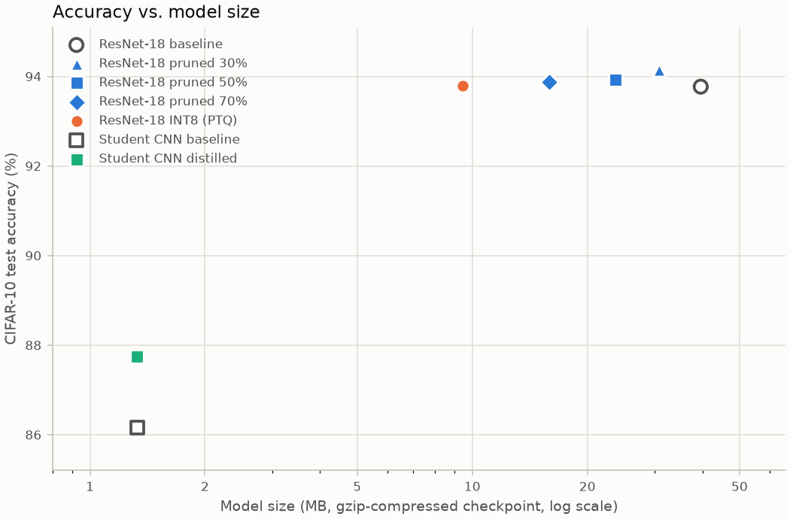
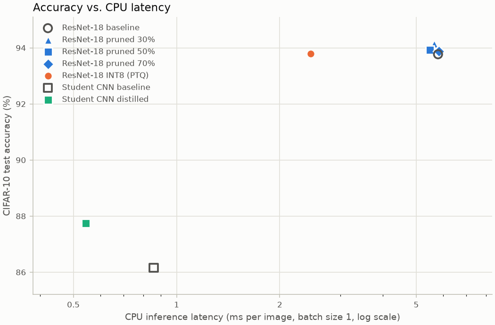

# Efficient Deep Learning on CIFAR-10: Pruning, Quantization, Distillation

Deep Learning course project (topic 25). A ResNet-18 trained on CIFAR-10 is compressed with three techniques, and every model is compared on accuracy, size and CPU latency.

- **Pruning:** global L1 unstructured pruning of the conv weights at 30 / 50 / 70 %, then 10 epochs of fine-tuning ([prune.py](prune.py)).
- **Quantization:** post-training static INT8 quantization, calibrated on 500 images ([quantize.py](quantize.py)).
- **Distillation:** a 0.37M-parameter CNN trained to imitate the ResNet-18 (T = 4, α = 0.5) ([distill.py](distill.py)).

## Run

Requires Python 3.13 and an NVIDIA GPU. CIFAR-10 downloads automatically on first use (see [DATA.md](DATA.md)).

```powershell
python -m venv venv; venv\Scripts\activate; pip install -r requirements.txt
python train_baselines.py; python prune.py; python quantize.py; python distill.py; python evaluate.py
```

The full pipeline takes about 40 minutes on an RTX 4050 laptop. Add `--debug` to any script for a 1-epoch smoke test.

## Results

<!-- results:start -->
| Model | Accuracy (%) | Δ acc (pp) | Size (MB) | gzip (MB) | Compression | Params | Non-zero | CPU latency (ms) | Speed-up |
|---|---:|---:|---:|---:|---:|---:|---:|---:|---:|
| ResNet-18 baseline | 93.77 | +0.00 | 42.70 | 39.59 | 1.0× | 11.17M | 11.17M | 5.79 | 1.0× |
| ResNet-18 pruned 30% | 94.14 | +0.37 | 42.70 | 30.80 | 1.3× | 11.17M | 7.83M | 5.65 | 1.0× |
| ResNet-18 pruned 50% | 93.92 | +0.15 | 42.70 | 23.69 | 1.7× | 11.17M | 5.59M | 5.47 | 1.1× |
| ResNet-18 pruned 70% | 93.87 | +0.10 | 42.70 | 15.91 | 2.5× | 11.17M | 3.36M | 5.83 | 1.0× |
| ResNet-18 INT8 (PTQ) | 93.79 | +0.02 | 10.78 | 9.44 | 4.2× | 11.17M | 11.02M | 2.46 | 2.4× |
| Student CNN baseline | 86.16 | -7.61 | 1.44 | 1.33 | 29.7× | 0.37M | 0.37M | 0.86 | 6.8× |
| Student CNN distilled | 87.75 | -6.02 | 1.44 | 1.33 | 29.8× | 0.37M | 0.37M | 0.54 | 10.6× |

CPU latency = one 32×32 image (batch size 1), median of 100 runs after 10 warm-up runs, 14 threads, PyTorch 2.14.1+cu132. MB = 2^20 bytes. Compression, speed-up and Δ acc are relative to the ResNet-18 baseline; compression uses the gzip size, because pruned weights are only smaller on disk once their zeros are compressed.

- **Best accuracy retention per MB saved:** ResNet-18 pruned 30%: +0.37 pp accuracy for 8.8 MB saved (1.3× smaller).
- **Fastest CPU inference:** Student CNN distilled: 0.54 ms per image, 10.6× faster than the baseline, -6.02 pp accuracy.
- **Distillation gain:** +1.59 pp over the same CNN trained with cross-entropy only, at identical size and latency.
<!-- results:end -->




## Takeaways

- **Pruning** keeps the accuracy and shrinks the compressed file, but does not speed up inference: the zeros are still multiplied by dense kernels.
- **INT8 quantization** is about 4× smaller and 2× faster on the CPU, with no retraining and almost no accuracy loss.
- **Distillation** gives the smallest and fastest model, and beats the same CNN trained without a teacher, but it stays about 6 pp below the ResNet-18.
